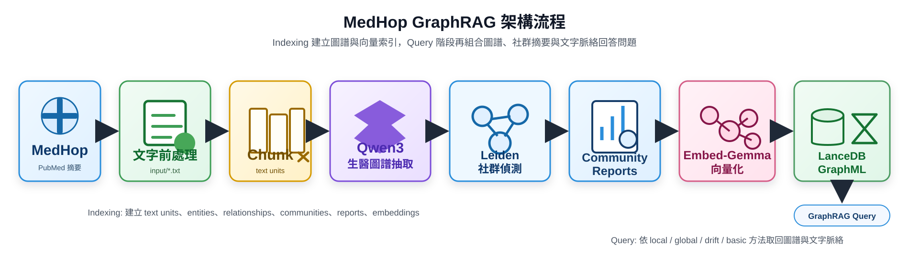

# MedHop GraphRAG 教材

以 Microsoft GraphRAG、MedHop 生醫多跳問答資料與 OpenAI-compatible
模型 API 建立可查詢的生醫知識圖譜。本專案提供 CLI 與 Streamlit 介面，並以
`graphrag_npu_0722/` 作為主要 GraphRAG root。

## 開始前

| 項目 | 說明 |
| --- | --- |
| Python | 3.10 或 3.11 |
| Windows | 可直接使用預設 Lemonade / AMD NPU 設定。詳見 [Windows 指南](docs/platforms/windows.md)。 |
| macOS | 需提供相容的 OpenAI-compatible chat 與 embedding endpoint。詳見 [macOS 指南](docs/platforms/macos.md)。 |
| 資料 | MedHop 與衍生 input 不隨 repository 散布；請依 [data/README.md](data/README.md) 自行下載。 |

## 首次啟動

依下列步驟完成第一次 indexing。資料量、模型與硬體會影響所需時間。

### 1. 下載專案

```text
git clone https://github.com/Lydia-HML/medhop-graphrag.git
cd medhop-graphrag
```

### 2. 建立 Python 環境

先確認 `python --version`（Windows）或 `python3 --version`（macOS）為
3.10 或 3.11。

**Windows PowerShell**

```powershell
python -m venv .venv
.\.venv\Scripts\Activate.ps1
pip install -r requirements.txt
```

**macOS (zsh/bash)**

```bash
python3 -m venv .venv
source .venv/bin/activate
pip install -r requirements.txt
```

### 3. 設定模型 endpoint 與 API key

預設 `graphrag_npu_0722/settings.yaml` 使用下列 Windows Lemonade / NPU
設定：

| 設定 | 預設值 |
| --- | --- |
| API base | `http://127.0.0.1:13305/api/v1` |
| Chat model | `qwen3-it-4b-FLM` |
| Embedding model | `embed-gemma-300m-FLM` |

Windows 使用者可直接使用預設值。macOS 使用者請先依
[macOS 指南](docs/platforms/macos.md) 更新 `settings.yaml` 的 endpoint 與模型名稱。

若本機 endpoint 不檢查 key，可使用佔位值：

**Windows PowerShell**

```powershell
$env:GRAPHRAG_API_KEY="local"
```

**macOS (zsh/bash)**

```bash
export GRAPHRAG_API_KEY="local"
```

啟動模型 API 後，確認 endpoint 可連線：

**Windows PowerShell**

```powershell
Invoke-RestMethod http://127.0.0.1:13305/api/v1/models
```

**macOS (zsh/bash)**

```bash
curl YOUR_API_BASE/models
```

### 4. 下載並準備 MedHop 資料

```text
python scripts/download_medhop.py
python scripts/prepare_medhop.py
```

原始資料會存於 `data/raw/medhop/`，GraphRAG input 會寫入
`graphrag_npu_0722/input/`。兩者均被 Git 忽略。資料授權與引用要求請見
[data/README.md](data/README.md)。

### 5. 建立 index

```text
graphrag index --root graphrag_npu_0722
```

完成後，`graphrag_npu_0722/output/` 會包含 entities、relationships、
communities、community reports、LanceDB 與 GraphML 等本機產物。

### 6. 查詢或啟動介面

```text
graphrag query --root graphrag_npu_0722 --method local "Which biomedical entities are connected?"
python -m streamlit run app.py
```

Streamlit 固定使用 `graphrag_npu_0722` 作為 GraphRAG root。

## 常見問題

### 查詢失敗

依序確認：

1. 模型 API 已啟動，而且 `/models` 可連線。
2. `GRAPHRAG_API_KEY` 已設定。
3. `settings.yaml` 的 API base、模型名稱與 embedding 維度符合 endpoint。
4. `graphrag_npu_0722/input/` 已有文件，且 `output/` 已由 indexing 產生。
5. Windows 若遇到 Python CA 憑證問題，改用
   `python graphrag_npu_0722/run_graphrag.py` 執行 GraphRAG。詳見
   [Windows 指南](docs/platforms/windows.md)。

### 改了資料、prompt 或模型後需要重跑 index 嗎？

需要。input、prompt、模型或 chunking 改變時，entities、relationships、
communities、reports 與 vector index 都可能不再一致，應重新執行：

```text
graphrag index --root graphrag_npu_0722
```

## 平台與硬體

| 項目 | 建議 |
| --- | --- |
| OS | Windows 11 或 macOS |
| Windows runtime | Lemonade / AMD NPU / GPU 或其他相容 endpoint |
| macOS runtime | 本機或遠端 OpenAI-compatible endpoint |
| Memory | 至少 16 GB RAM；較大資料建議 32 GB 以上 |
| Reference macOS system | MacBook Pro 14-inch (November 2023), Apple M3 Max, 64 GB, macOS Sequoia 15.6 |

## GraphRAG 如何運作

GraphRAG 不只對文字 chunk 做向量搜尋。它會從文件抽取實體與關係，建立圖結構，
產生社群摘要，並結合文字、圖譜與向量索引回答問題。



```text
MedHop documents
-> token chunking
-> entity and relationship extraction
-> graph construction
-> Leiden community detection
-> community reports and LanceDB vector indexes
-> GraphRAG query
```

| 階段 | 專案對應 | 說明 |
| --- | --- | --- |
| MedHop 資料 | `data/raw/medhop/`、`graphrag_npu_0722/input/` | 使用者自行下載並轉成 input 文件。 |
| 圖譜抽取 | `completion_models`、`prompts/extract_graph.txt` | LLM 抽取生醫實體與關係。 |
| 社群偵測 | `cluster_graph` | Leiden 將圖譜分群。 |
| 向量化 | `embedding_models` | 將文字、實體描述與社群內容建立 embedding。 |
| 查詢 | `graphrag query`、`app.py` | 結合圖譜、文字與社群內容回答問題。 |

## 進階使用

### Query method

| Method | 適合情境 |
| --- | --- |
| `local` | 具體的 gene、drug、disease 或 evidence 關係問題。 |
| `global` | 整份資料的主題、趨勢或大型關係模式。 |
| `drift` | 從問題出發，沿相關實體與 community 擴展脈絡。 |
| `basic` | 較單純的文字與向量脈絡查詢。 |

教材建議先使用 `local`，因為 MedHop 題目通常需要在局部生醫實體關係中找證據。

### 重要參數

設定檔位於 `graphrag_npu_0722/settings.yaml`。

| 參數 | 目前值 | 調整方向 |
| --- | --- | --- |
| `concurrent_requests` | `1` | 本機模型不穩時維持 1；硬體較強時可逐步增加。 |
| `chunking.size` | `450` | 較大會保留較多上下文，但增加索引成本與錯誤風險。 |
| `chunking.overlap` | `60` | 避免跨 chunk 資訊斷裂；過高會增加成本。 |
| `vector_size` | `768` | 必須與 embedding model 的輸出維度一致。 |
| `top_k_entities` | `6` | Local search 取回的相關實體數。 |
| `top_k_relationships` | `20` | 多跳問題可適度提高。 |
| `max_context_tokens` | `2400` | 提高會增加延遲與模型負擔。 |

### MedHop 評估

執行少量 MedHop multiple-choice 評估：

```text
python graphrag_npu_0722/evaluate_medhop.py --method local --limit 5
```

結果預設寫入 `graphrag_npu_0722/medhop_evaluation.csv`。評估時應要求模型只輸出
候選答案，正規化輸出後再與 gold answer 進行 exact match。

### 其他工具與文件

| 資源 | 用途 |
| --- | --- |
| [GRAPHRAG_QUICKSTART.md](GRAPHRAG_QUICKSTART.md) | 精簡指令版本。 |
| [PROJECT_STRUCTURE.md](PROJECT_STRUCTURE.md) | 完整檔案結構說明。 |
| `graphrag_npu_0722/import_to_neo4j.py` | 匯入 GraphRAG 產物至 Neo4j。 |
| `graphrag_npu_0722/GRAPHRAG_NPU_0722_EXPERIMENT.md` | 實驗紀錄與歷史細節。 |
| [AMD AIPC MedHop GraphRAG](https://gamma.app/docs/AMD-AIPC-MedHop-GraphRAG--ck9fdgg1feyy6u1?mode=doc) | 教學簡報。 |
| [YouTube Demo](https://youtu.be/n04f6Txv7yU) | Demo 影片。 |

## License

Original source code in this repository is licensed under the Apache License
2.0. Different terms apply to third-party datasets, model weights, runtimes,
and educational media:

- MedHop data and derived data: CC BY-SA 3.0
- Microsoft GraphRAG: MIT License
- Qwen3 model weights: Apache License 2.0
- EmbeddingGemma: Google Gemma Terms of Use
- Lemonade runtime: Apache License 2.0
- Original diagrams and teaching materials: CC BY 4.0 unless otherwise stated

MedHop data, model weights, and GraphRAG-generated artifacts are not
distributed with this repository. See [THIRD_PARTY_NOTICES.md](THIRD_PARTY_NOTICES.md)
and [data/README.md](data/README.md) for attribution and usage details.
